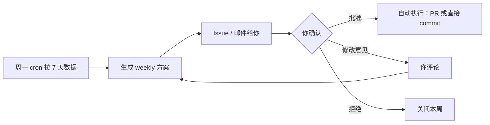

# SEO / GEO / 增长自动化 — 产品需求 v2

> 在 v1（半月拉数 + Issue 提醒）基础上升级。  
> 最后更新：**2026-05-22**

---

## 1. 目标（你要的三件事）

| # | 需求 | 频率 | 交付 |
|---|------|------|------|
| 1 | **日报**：全站健康度 + GA4/GSC 专业读法 | **每天** | `reports/daily/YYYY-MM-DD.md` + 可选推送 |
| 2 | **优化方案**：SEO / GEO / 可自动化改动 | **每周** | 方案 → **你确认** → 自动执行 |
| 3 | **洞察**：需你手动的项 + 外部搜什么 + 可加功能/内容 | **每周**（合并在方案里） | 方案 § 洞察 + 时效说明 |

---

## 2. 日报（§1 详述）

### 2.1 每天自动跑什么

```
cron 每天 UTC 09:00（北京 17:00）
  → 拉 GA4「昨日 + 近7天对比」+ GSC「近3天（滞后）」
  → 静态自检（sitemap/meta/404 关键页）
  → 写 daily 报告 + commit
  → Issue 评论或 ntfy（摘要 5 行）
```

### 2.2 GA4 专业日报看什么（脚本应拉取的维度）

| 板块 | 指标 | 为什么看 |
|------|------|----------|
| **规模** | 活跃用户、新用户、会话数 | 站有没有被用起来 |
| **质量** | 互动率、平均互动时长、跳出（若有） | 来的人是不是真在用工具 |
| **获客** | 渠道：Organic / Direct / Referral / Social | SEO 是否起量 |
| **页面** | Top 5 着陆页、Top 5 页面浏览 | 哪条路线/哪页是入口 |
| **地域** | 国家/地区 Top 3 | 日/中/英哪类用户 |
| **设备** | Mobile vs Desktop | 和移动端 PDF/地图体验是否匹配 |
| **搜索（GA4）** | Organic Google 会话（若 linked） | 与 GSC 交叉验证 |
| **异常** | 较前日 ±50% 的指标 | 部署/收录/爬虫异常 |

### 2.3 GSC 日报（数据滞后 2–3 天，标注清楚）

- 近 28 天展示/点击/CTR/排名（与上周同日比）
- Top 5 查询词、Top 5 页面
- 4 个核心 URL 索引状态（若有 OAuth）

### 2.4 日报不做什么

- **不改代码**、不开优化 PR
- 全 0 时写「新站正常」而非空报告

---

## 3. 每周优化（§2 详述）

### 3.1 流程（确认后再执行）



**方案文件**：`docs/seo/proposals/YYYY-WW-proposal.md`

含：

1. 数据摘要（GSC/GA4 7 天）
2. **建议改动清单**（meta / JSON-LD / page-lead / sitemap / llms.txt / 功能）
3. **GEO**（FAQ、实体描述、AI 爬虫可读段落）
4. **仅手动**项（见 §4）
5. **外部洞察**（搜什么、竞品、时效窗口）
6. **拟执行 diff 摘要**（改哪些文件）

### 3.2 一定要用 Cursor 吗？— **不必**

| 方式 | 角色 | 适合 |
|------|------|------|
| **GitHub Issue + PR**（推荐） | Actions 生成方案 → 你 Issue 回复 `approve` → Actions 开 PR 或 bot commit | 不依赖 IDE，可手机批 |
| **Cursor / Claude Code** | 你说「按本周方案执行」 | 改动复杂、需讨论时 |
| **OpenClaw / 定时 Agent** | 服务器上跑同一套脚本 + skill | 无 IDE、要 7×24 |
| **n8n / Make** | Webhook 接 Issue 评论触发 | 低代码 |
| **纯脚本** | 只改 meta 模板等规则化项 | 改动固定、风险低 |

**建议默认**：GitHub **方案 Issue + `workflow_dispatch` 输入 `proposal_id` + approve label** 执行；Cursor 仅作「方案审阅/复杂改版」的可选界面。

### 3.3 可自动执行（你批准后）

- title / description / `page-lead` / JSON-LD / `sitemap lastmod`
- `llms.txt` / `TRACKING.md` / `CHANGELOG.md`
- 官方 PDF 变更检测 → Issue 提醒（不自动改时刻表数据，除非你再确认）
- 轻量 UI copy（i18n 键）若写在方案里

### 3.4 必须你确认才执行

- 改 URL 结构、删页面
- 新增整页 / 大段攻略内容
- 运价/时刻表数据变更
- 任何影响「工具站」定位的方向性改动

---

## 4. 需你手动 vs 可自动（§3 详述）

### 4.1 通常需你手动

| 项 | 原因 |
|----|------|
| GSC **URL 检查 → 请求编入索引**（新页/大改后） | Google 无稳定全自动 API 替代 |
| OAuth token 过期重跑 | 年级别，脚本 + 文档即可 |
| 运营商 **PDF 时刻表换版** | 需核对后 `build_all` |
| 外链 / 小红书 / 社群推广 | 产品增长，非代码 |
| Search Console 体验/核心网页指标 **实地测速** | 需 PageSpeed 人工判断 |
| 竞品定价/船票政策变更 | 需读官网 |

### 4.2 可自动或半自动

| 项 | 方式 |
|----|------|
| meta / 结构化数据微调 | 每周方案批准后 Actions |
| 监控官方 PDF URL HTTP HEAD | cron 变更 → Issue |
| 日报/周报数据 | 已有 pipeline 扩展 |
| 「People also search」类洞察 | 每周 Web 研究写入方案（见 §5） |
| GA4 自定义事件（查路线、打开 PDF） | 需先加 `analytics.js` 事件（一次性） |

---

## 5. 产品洞察框架（每周更新）

### 5.1 屋久岛 / 离岛 — 当前高意图主题（2026-05 时效）

| 优先级 | 用户在搜什么 | 本站已有 | 建议 |
|--------|--------------|----------|------|
| P0 | 屋久島 バス 時刻表 / 2026年3月 改正 | ✅ 核心 | 标题显式「2026/3–11」；GSC 有词后微调 description |
| P0 | 鹿児島 屋久島 高速船/フェリー 時刻表・予約 | ✅ `/access/` | 强化 jetfoil/フェリー 长尾；booking 卡片已有可观测点击 |
| P1 | 宮之浦港→白谷/屋久杉/安房 バス | ✅ 路线搜索 | 着陆页 `page-lead` 含地名组合 |
| P1 | 屋久島 行き方 / how to get to Yakushima 2026 | 部分 | `/access/` meta 英日中文「2026」 |
| P2 | 白谷線 運休 / 台風 バス | 数据里有运营注记 | 首页 aux 可加「運休・遅延は公式PDF参照」一行（静态） |
| P2 | 離島 旅行 準備（通用离岛） | ❌ 不做攻略 | **不做**长文；最多 1 条 FAQ 链回工具页 |

**竞品内容**（供差异化，不抄）：japan-guide、hiddenjapan-gems、yakukan.jp、yakushima-tour.com — 他们做攻略，你做 **可查时刻表/运价/船班**。

### 5.2 GEO（生成式搜索 / AI 引用）

- 保持 **HTML 内静态日文导语**（`page-lead`），不依赖 JS
- `llms.txt` 说明站点用途、数据出处、四 URL
- FAQ JSON-LD 仅答 **交通事实**（勿写主观攻略）
- 实体名一致：Yakushima Bus / 屋久島バス / 屋久岛公交

### 5.3 功能向洞察（需你拍板）

| 想法 | SEO/GEO | 工作量 | 建议 |
|------|---------|--------|------|
| GA4 事件：选路线、查下一班、开 PDF | 懂真实功能使用率 | 小 | 值得做 |
| 台风/運休 状态条（链官方） | 长尾「運休」 | 小 | 可选 |
| `/tips/` 乘车 1 页 | 长尾词 | 中 | 仅当你同意弱化「纯工具」 |
| 多语言 hreflang | 国际 SEO | 中 | 有国际展示后再做 |

*每周方案会刷新 §5.1（Web 研究 + GSC Top 词），上表为 2026-05-22 基线。*

---

## 6. 与现有仓库的映射

| v2 需求 | 现状 | 待建 |
|---------|------|------|
| 日报 | ✅ `seo-daily.yml` + `seo_fetch_daily.py` + `seo_report_daily.sh` | 飞书 Secrets（可选） |
| 周报方案 | ✅ `seo-weekly.yml` + `proposals/` + Issue | `approve` → PR 的执行 workflow |
| GSC 读数 | OAuth 脚本已写，待你配 Secret | 配完后日报/周报共用 |
| 执行层 | Cursor skill `seo-round` | GitHub `approve` → PR 的 Actions |
| 洞察 | 方案模板 § 洞察 + 2026-05 基线 | 可选 Trends 脚本 |

---

## 7. 建议实施顺序

1. ~~**你**：完成 GSC OAuth Secrets → 验证 `✓ GSC 28d`~~（GA4 ✅；GSC OAuth 仍待配）
2. ~~**开发**：日报 workflow + GA4 扩展指标~~ ✅ 2026-05-22
3. ~~**开发**：周报「只出方案、不执行」+ Issue 模板~~ ✅ 2026-05-22
4. **开发**：`approve` 触发 PR 的执行 workflow（1 天）
5. **开发**：PDF 变更检测 + GA4 关键事件（可选）
6. **你**（可选）：飞书三个 Secret → 日报同步云文档

---

## 8. 实施进度（2026-05-22）

| 项 | 状态 |
|----|------|
| `scripts/seo_fetch_daily.py` | ✅ daily-*.json + daily-latest.json |
| `scripts/seo_report_daily.sh` | ✅ 修复 heredoc；支持 latest.json 回退 |
| `scripts/seo_report_weekly.sh` | ✅ proposals + Issue 标题 `seo-round YYYY-WW` |
| `scripts/seo_feishu_doc.py` | ✅ 可选飞书；未配 Secret 则跳过 |
| `.github/workflows/seo-daily.yml` | ✅ 每天 UTC 09:00 |
| `.github/workflows/seo-weekly.yml` | ✅ 每周一 UTC 09:30 |
| `docs/seo/FEISHU_SETUP.md` | ✅ |
| `approve` 自动执行 PR | ⏳ 下一迭代 |

## 9. 文档索引

- **教程（公开）**：[tutorial/README.md](tutorial/README.md)
- **私人清单**：[PRIVATE_SETUP.md](PRIVATE_SETUP.md)
- 授权：[tutorial/02-Google授权.md](tutorial/02-Google授权.md)
- 总流程：[RUNBOOK.md](RUNBOOK.md)
- 通知：[NOTIFICATIONS.md](NOTIFICATIONS.md)
- v1 变更：[CHANGELOG.md](CHANGELOG.md)
